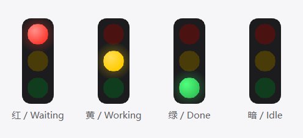

# Claude Traffic Light

> A visible traffic light for Claude Code. Keep it on your desktop and know at a glance whether it is working, waiting for you, or done.  
> 给 Claude Code 一盏看得见的灯。固定在桌面上，一眼就知道它是在干活、在等你、还是干完了。



The four states, rendered offscreen.
四种状态的离屏渲染图。

## Four States / 四态

The light has four states, and none of them is ambiguous:

四种状态，每一种都没有歧义：

| Light / 灯 | State | Meaning / 含义 |
|---|---|---|
| 🔴 Red (flashing) / 红（闪烁） | Waiting | Needs your reply, confirmation, approval, or more files / 需要你的回复、确认、授权或补充文件 |
| 🟡 Yellow (steady) / 黄（常亮） | Working | The agent is heads-down — go get a coffee / AI 正在努力干活，安心喝咖啡 |
| 🟢 Green (steady) / 绿（常亮） | Done | Finished and ready to review. **Goes dark only after you click it** / 干完了，可以验收。**单击确认后才熄灭** |
| ⚫ Dark / 暗 | Idle | Nothing active / 没有活跃任务 |

Green deliberately does **not** time out — only your click turns it off. The cost is that the light stays green while you are away from your desk; the payoff is that a completion event is never missed.

**Completely silent.** No sound at all, purely visual.

绿灯刻意**不超时自动熄灭**——只有你点过它才算数。代价是离开工位时灯会一直绿着，
好处是完成事件绝不会被错过。

**完全静音**，不发出任何声音，纯视觉提示。

## How It Works / 工作原理

```
Claude Code events / 事件
      │  hooks (async, non-blocking) / 不阻塞
      ▼
src/hook_writer.py  ──atomic write / 原子写──▶  %LOCALAPPDATA%\ai-traffic-light\sessions\<session>.json
                                            │  polled every 250ms / 每 250ms 轮询
                                            ▼
                                   src/widget.py (PySide6 floating window / 悬浮窗)
```

Each Claude Code session writes its own state file, so sessions never interfere with each other. The UI aggregates them into a single light by priority — **red > green > yellow > dark** — so alerts are never lost when several sessions run at once.

每个 Claude Code 会话写一个独立的状态文件，互不干扰；UI 端按
**红 > 绿 > 黄 > 暗** 的优先级聚合成一盏灯，所以多个会话同时跑也不会漏掉告警。

## Installation / 安装

```bash
git clone https://github.com/xz-code/claude-traffic-light.git
cd claude-traffic-light

python -m venv .venv
.venv\Scripts\pip install -r requirements.txt

python install.py install        # install into settings.json (backed up first) / 装进 ~/.claude/settings.json（会先备份）
python install.py autostart-on   # optional: launch at login / 可选：开机自启
```

> **Reinstall the hook after upgrading (mandatory for the portable build).** The hook runtime is **copied** to `%LOCALAPPDATA%\ai-traffic-light\hook\`, so a new version does not update it automatically. The symptom is a tooltip with no session name and English reasons. Right-click the tray icon → "Uninstall hook", then → "Install hook". In development mode you run `src\` directly and can skip this.
>
> Note that the tray menu **cannot detect** this case: it compares the hook directory's *path*, not the file contents, so "same directory, stale files" looks perfectly healthy to it.

> **升级后要重装 hook（便携版必做）。** hook 运行时是被**复制**到
> `%LOCALAPPDATA%\ai-traffic-light\hook\` 的一份副本，换版本不会自动更新。
> 症状是提示里没有会话名、原因还是英文。托盘右键点一次「卸载 hook」，
> 再点一次「安装 hook」即可。开发模式直接跑 `src\`，不用这一步。
>
> 注意托盘菜单**认不出**这种情况：它比对的是 hook 目录的路径，不是文件内容，
> 所以"同一个目录但文件旧了"它认为一切正常。

## Start / Stop / 启动与停止

Once installed, day-to-day use is just two double-clicks:

| File | Purpose |
|---|---|
| **`start.bat`** | Launch the light (no console window; pinnable to the taskbar or Start menu) |
| **`stop.bat`** | Stop it. The tray icon's "Quit" is handier day to day; this is the escape hatch for when the tray is out of reach |

装好之后日常只需要双击两个文件：

| 文件 | 作用 |
|---|---|
| **`start.bat`** | 启动信号灯（无黑框窗口，可固定到任务栏/开始菜单） |
| **`stop.bat`** | 停止。平时用托盘图标的「退出」更顺手，这个是托盘够不着时的逃生口 |

Equivalent from the command line:

命令行等价写法：

```bash
.venv\Scripts\pythonw.exe src\main.py    # start / 启动
.venv\Scripts\python.exe tools\stop.py   # stop / 停止
```

**Only one light may run.** A duplicate launch is blocked by a named mutex, so you never end up with two lights stacked on top of each other. On startup the pid is written to `%LOCALAPPDATA%\ai-traffic-light\light.pid`, and `stop.bat` uses it to stop precisely — it does not guess by matching the command line. Matching would not work anyway: the venv's `pythonw.exe` is launched with a relative path, so the project name never appears in its command line, while any keyword you might match on also shows up in the command line of the shell doing the matching — which would then kill itself.

**只允许开一盏灯**：重复启动会被命名互斥体挡掉，不会出现两盏叠在一起。
启动时会把 pid 写进 `%LOCALAPPDATA%\ai-traffic-light\light.pid`，
`stop.bat` 靠它精确停止——不靠匹配命令行去猜
（venv 的 `pythonw.exe` 用相对路径启动，命令行里根本没有项目名；
而用来匹配的关键字又出现在执行匹配的 shell 自己的命令行里，会连自己一起杀）。

## Interaction / 交互

| Action | Effect |
|---|---|
| Drag | Move the light (position is remembered; multi-monitor safe) |
| **Click the lit bulb** (while red) | Bring the VSCode window that is waiting for you to the foreground |
| **Click the lit bulb** (while green) | Acknowledge — the green light goes out |
| Hover | Rich tooltip: one line per session (`project · prompt` plus a coloured state word), the waiting reason, and a footer hint |
| Right-click | Jump to the waiting window / ignore a session / reset position / quit |
| **Right-click → Ignore session → pick one** | Drop a session you no longer care about from the aggregate (affects only that one) |
| Tray icon | Follows the light's colour; show, hide, or quit |

**The click target is deliberately limited to the lit bulb.** The shell and the unlit bulbs are dead zones. See "Click Safety" below for why.

| 操作 | 效果 |
|---|---|
| 拖动 | 移动位置（自动记忆，多显示器安全） |
| **单击点亮的那颗灯珠**（红灯时） | 把等待你的那个 VSCode 窗口拉到前台 |
| **单击点亮的那颗灯珠**（绿灯时） | 确认，绿灯熄灭 |
| 悬停 | 富文本提示：每个会话一行（`项目 · 指令` + 彩色状态词）、等待原因、底部操作提示 |
| 右键 | 跳到等待中的窗口 / 忽略会话 / 回到默认位置 / 退出 |
| **右键 → 忽略会话 → 选一个** | 把某个你不再关心的会话从聚合里摘掉（只影响这一个） |
| 托盘图标 | 跟随灯色变化，可显示隐藏或退出 |

**点击区刻意只限于点亮的那颗灯珠**，外壳和没亮的灯珠都是死区。
原因见下面「点击安全性」。

### What the Tooltip Shows / 悬停提示读什么

A dark card, one line per session: `project · prompt` on the left, the same coloured state word on the right, right-aligned.

深色卡片，一行一个会话：左边是 `项目 · 指令`，右边是同样带色的状态词，右边缘对齐。

- **The title prefers the summary Claude Code itself writes** for the session (read from the session transcript, "what we're working on"). It falls back to **the first question you typed** (truncated to 24 characters) when there is none. **Roughly half of all sessions have no AI summary** — subagent transcripts never do — so the fallback is a normal path, not an error. The first-question title never changes once written, which is what lets you tell two sessions in the same project apart even after the AI title drifts.
- Sessions that were already open before this upgrade have neither and show as `project · #first-8-chars-of-session-id`. That is not a fault — it disappears when the session ends.
- Only **non-dark** sessions are listed, at most 6; beyond that they collapse into `…and N more`. A red session is always the first row, in bold.
- **Waiting reasons are in Chinese.** When a case is unrecognised, the tooltip says one generic sentence rather than pasting Claude Code's English original.
- **No flicker while the mouse rests**: the tooltip is only rebuilt when its content actually changes. (It used to be rebuilt unconditionally every 250ms, recomputing its size and position while visible.)

- **标题优先用 Claude Code 自己总结的会话名**（从 transcript 里读，也就是"在聊什么"），
  没有才回退到**你打的第一句提问**（截到 24 字）。**约一半的会话没有 AI 总结**
  （子 agent 的 transcript 一律没有），所以回退是正常路径，不是故障。
  第一句提问这个标题一旦写下就不再变，所以哪怕 AI 标题中途漂移了，
  同项目的两个会话照样分得清。
- 本次升级之前就开着的会话两个都没有，显示成 `项目 · #会话号前8位`。
  不是故障，那个会话结束就没了。
- 只列**非暗态**会话，最多 6 行，再多折叠成 `…还有 N 个`。红灯永远在第一行、加粗。
- **等待原因是中文**。认不出的场景宁可只说一句笼统的话，也不把 Claude Code 的
  英文原文糊上去。
- 鼠标停住时**不闪**：只有内容真的变了才会重设提示框（改之前是每 250ms 无条件重设，
  正在显示时会被反复重算尺寸和位置）。

### Why "Ignore Session" Exists / 为什么需要「忽略会话」

Red has exactly one automatic exit: **the next event from the same session**. But an abandoned session — VSCode window open, `claude.exe` still alive — will never produce a next event, and the zombie cleanup cannot reach it either, because the process is still running. So that red light flashes forever, and since red has absolute priority it buries the green and yellow of your other sessions along with it.

Right-click → Ignore session → click that one: its state file is deleted and the red light steps aside immediately.

**This is not a permanent mute.** If that session does anything real again — a new permission request, a new tool call, the turn ending — it comes back on its own. So "ignore" means "I don't want this round", not "never bother me about this again".

The menu entry marked `●` is the session currently holding the light. If you ignore a red session that is **not** marked `●`, the light may stay red — that means another red is holding it, not that your action failed.

As for why it lives in the right-click submenu rather than on a bulb click: it deletes state. And clicking the bulb has to have zero error cost — see "Click Safety" below.

红态只有一个自动出口：**同一个会话的下一个事件**。而一个被丢下的会话
（VSCode 窗口开着、`claude.exe` 还活着）永远不会有下一个事件——僵尸清理也够不着它，
因为进程还活着。于是那盏红灯永远闪，还因为红是绝对优先级，把你其他会话的绿/黄
一起盖住。

右键 → 忽略会话 → 点那一个：它的状态文件被删掉，红灯立刻让位。

**这不是永久静音**——那个会话下次真有动静（新的授权请求、新的工具调用、回合结束）
时会自己回来。所以"忽略"的语义是"这一轮我不要了"，不是"以后都别烦我"。

菜单里带 `●` 的那一条就是正在点亮这盏灯的会话。忽略一个**非** `●` 的红灯时灯可能
仍是红的——那是另一个红灯在占位，不是没生效。

至于为什么把它放在右键子菜单、而不是单击灯珠上：它会删状态。而你单击灯珠的犯错
成本必须是零——见下面「点击安全性」。

## File Layout / 文件结构

```
src/core.py              shared core: paths, state definitions, event mapping, process-chain walk
src/hook_writer.py       hook side (standard library only, no venv required)
src/aggregator.py        scans state files, zombie cleanup, priority aggregation
src/tooltip.py           tooltip copy, colours and rich-text rendering (pure logic, no Qt)
src/widget.py            PySide6 floating window
install.py               hook install / uninstall / status / autostart
tools/simulate.py        drives the light without Claude Code; debugging and previewing
tools/render_preview.py  renders the four-state preview image offscreen
tools/render_tooltip.py  renders the tooltip offscreen; measures right-column alignment
tools/test_hover.py      hover-panel state machine (delay, grace, drag, positioning)
tools/probe_ai_title.py  probe: measures where Claude Code keeps the AI session title
probe_hook.py            probe: dumps raw hook events to disk for diagnosis
docs/hook-findings.md    every measurement we took (with verification status noted)
```

```
src/core.py          共享核心：路径、状态定义、事件映射、中文文案、进程链回溯
src/hook_writer.py   hook 端（纯标准库，不依赖 venv）
src/aggregator.py    扫描状态文件、僵尸清理、优先级聚合
src/tooltip.py       悬停提示的文案、配色与富文本渲染（纯逻辑，不依赖 Qt）
src/widget.py        PySide6 悬浮窗
install.py           hook 安装 / 卸载 / 状态 / 开机自启
tools/simulate.py    不启动 Claude 也能驱动灯，用于调试和预览
tools/render_preview.py  离屏渲染四态预览图
tools/render_tooltip.py  离屏渲染悬停提示 + 量右列对齐
tools/test_hover.py  悬停面板状态机（延迟、宽限、拖动、摆位）
tools/probe_ai_title.py  探针：量 Claude Code 把会话标题藏在哪、离文件尾多远
probe_hook.py        探针：把原始 hook 事件落盘，排查用
docs/hook-findings.md  全部实测记录（含验证状态标注）
```

## Development / 开发

```bash
# Event mapping and aggregation: 26 typical steps in one command, each asserted
# 事件映射与聚合：一条命令跑完 26 步典型场景并逐条断言
python tools/simulate.py map      # print the event mapping table / 打印事件映射表自检
python tools/simulate.py playback        # replay at real pace / 按真实节奏回放，边看灯边对数
python tools/simulate.py playback fast   # no delays, pure assertions / 不打间隔，纯断言
python tools/simulate.py multi    # three concurrent sessions / 造三个并发会话，验证优先级聚合
python tools/simulate.py red      # force the red state / 手动摆出红态
python tools/simulate.py clear    # clear simulated sessions / 清掉模拟会话

# Click-detection regression test / 点击判定回归测试
.venv\Scripts\python.exe tools\test_click.py

# Ignore-session regression test (deletion scope, revival, menu wiring)
# 忽略会话的回归测试（删除范围、复活语义、菜单接线）
.venv\Scripts\python.exe tools\test_ignore.py

# Tooltip regression test (AI/first-prompt titles, Chinese reasons, escaping, alignment, no-flicker)
# 悬停提示的回归测试（AI/首句标题、中文原因、转义、对齐、防闪烁）
.venv\Scripts\python.exe tools\test_tooltip.py

# Hover state machine (delay, grace, drag suppression, panel placement)
# 悬停状态机（延迟弹出、离开宽限、拖动不弹、面板摆位）
# Brief flashes in the corner are expected — it asserts real visibility.
# 屏幕角落会闪几下是正常的，它断言的就是真实可见性。
.venv\Scripts\python.exe tools\test_hover.py

# Regenerate the preview image / 重新生成预览图
.venv\Scripts\python.exe tools\render_preview.py

# See what the tooltip looks like without hovering the real light
# 悬停提示长什么样——不用去悬停真灯
.venv\Scripts\python.exe tools\render_tooltip.py            # fixed samples / 固定样例，一屏看全
.venv\Scripts\python.exe tools\render_tooltip.py --align    # check right-column alignment / 量右列有没有对齐
.venv\Scripts\python.exe tools\render_tooltip.py --live     # what mine looks like now / 我此刻的提示长什么样
```

When debugging, set `AI_TRAFFIC_LIGHT_DEBUG=1` for the floating window and it will log every state change, dropped session, and click decision to `%LOCALAPPDATA%\ai-traffic-light\debug.log`. Off by default, zero overhead.

排查问题时，给悬浮窗加 `AI_TRAFFIC_LIGHT_DEBUG=1` 环境变量，
它会把每次状态变化、丢弃会话、点击判定写进
`%LOCALAPPDATA%\ai-traffic-light\debug.log`。默认关闭，零开销。

## A Few Counterintuitive Constraints, All Measured / 几个实测得来的、反直觉的实现约束

These came from actually running things, not from reading docs. See [docs/hook-findings.md](docs/hook-findings.md) for the details.

这些都是实际跑出来的，不是照文档抄的。详见 [docs/hook-findings.md](docs/hook-findings.md)。

- **Red is driven by `PreToolUse` + `Notification`, not `PermissionRequest`** — in testing that event never fired once, even though permission prompts definitely appeared.
- **`Notification(idle_prompt)` must be ignored** — it is driven by a ~60-second timer heuristic, so it arrives late and fires spuriously during long thinking. Treating it as a signal means the red light turns on at random.
- **`SubagentStop` counts as yellow, not green** — a subagent finishing does not mean the main turn is over.
- **`PostToolUseFailure` counts as yellow, not red** — when a tool fails, Claude retries on its own; it is not waiting for anyone.
- **The `Stop` payload has no `stop_reason`**, so abnormal termination cannot be identified.
- **Zombie sessions are identified by the process chain**: the hook's parent process is a temporary shell that lives and dies in seconds, so you have to walk the chain until you find `claude.exe` to find the real owner.
- **The hook's `cwd` uses backslashes**, so both path comparison and window jumping have to normalise first.

- **红态走 `PreToolUse` + `Notification`，不靠 `PermissionRequest`**——
  实测这个事件一次都没触发过，虽然确实发生了授权提示。
- **`Notification(idle_prompt)` 必须忽略**——它是 ~60 秒定时器启发式驱动的，
  会延迟且会在长思考期间误报，拿它当信号等于随机亮红灯。
- **`SubagentStop` 归黄不归绿**——子代理干完不代表主回合结束。
- **`PostToolUseFailure` 归黄不归红**——工具失败时 Claude 会自己重试，并没有在等人。
- **`Stop` 载荷里没有 `stop_reason`**，无法识别异常结束。
- **僵尸会话靠进程链判定**：hook 的父进程是临时的 shell（秒生秒灭），
  必须沿链找到 `claude.exe` 才算找到主人。
- **hook 的 `cwd` 是反斜杠**，路径比较和跳转都要先规范化。

### Click Safety / 点击安全性

This is a small always-on-top floating window, and the mouse sweeps over it easily — while the consequence of a stray click is that **an alert gets silently acknowledged** and you never learn it was ever there. For a tool whose entire job is "don't let me miss it", that is unacceptable. So:

- **The click must land on the lit bulb**; the shell and the unlit bulbs are dead zones.
- **A paired press and release is required**, with no more than 6px of movement and no more than 1.5 seconds between them.

The second rule fixes a bug that really happened: the original code treated "no paired press" as "did not move", and therefore classified it as a click. Sweeping the mouse across the light with the left button held down, or a stray release when unlocking the screen, would both trigger a phantom click. It showed up as "the green light occasionally goes out by itself" and was extremely hard to reproduce.

The click logic is locked down by a regression test: `tools/test_click.py`.

**That is why "Ignore session" lives in the right-click submenu instead of on a click.** It is destructive too — it deletes an alert — and a right-click takes two actions to trigger, so it is not on the path the mouse sweeps across.

这是个置顶悬浮的小窗，鼠标很容易扫过它——而"误触"的后果是**告警被静默确认掉**，
你永远不会知道曾经有过告警。对一个"别让我错过"的工具来说，这不可接受。所以：

- **点击必须落在点亮的那颗灯珠上**，外壳和灭灯都是死区
- **必须有配对的按下 + 释放**，且移动不超过 6px、间隔不超过 1.5 秒

后者修的是一个真实发生过的 bug：原写法把"没有配对的按下"当成"没移动"，于是判定成点击。
鼠标按着左键扫过灯、或锁屏解锁时的一次游离 release，都会触发伪点击。
它表现为"绿灯偶尔自己灭了"，且极难复现。

判定逻辑有回归测试锁着：`tools/test_click.py`。

**「忽略会话」因此放在右键子菜单里，不占单击**。它同样是破坏性的（会删掉一次告警），
而右键要两下才能触发，也不在鼠标扫过灯珠的那条路径上。

### Atomic Writes on Windows / 原子写在 Windows 上的坑

`os.replace` throws `PermissionError` when the destination file **is open in any process** — even if that process is only reading. The UI polls every 250ms, so hitting that window is only a matter of time. So the hook side must retry on write (`src/hook_writer.py`), and the UI side must **never delete a session because a single read failed** — that would erase an alert out of thin air. Both have been hit and fixed.

`os.replace` 在目标文件**正被任何进程打开时**会抛 `PermissionError`——哪怕对方只是在读。
UI 端每 250ms 轮询一次，撞上这个窗口是迟早的事。所以 hook 端写入必须带重试
（`src/hook_writer.py`），且 UI 端**绝不能因为一次读取失败就删掉会话**——
那等于凭空抹掉一次告警。这两条都已经踩过并修好了。

## Uninstall / 卸载

```bash
python install.py uninstall      # remove hooks (this project's only) / 移除 hook，只删本项目的，保留你自己的其他 hook
python install.py autostart-off  # turn off launch at login / 关掉开机自启
```

## Credits / 致谢

Inspired by [vibecoding-signal-light](https://github.com/starlight36/vibecoding-signal-light) — a hardware take on the same problem (MCP2221A USB GPIO plus a physical traffic light). This project's hook event mapping and session-key priority draw heavily on what that project learned in practice, but both the semantics and the implementation are independent: it uses real hardware, this one uses a floating window on your screen.

灵感来自 [vibecoding-signal-light](https://github.com/starlight36/vibecoding-signal-light)——同一问题的
硬件实现（MCP2221A USB GPIO + 实体红绿灯）。本项目的 hook 事件映射与会话键优先级
大量参考了它的实战沉淀，但语义和实现都是独立的：它用真实硬件，本项目用屏幕上的悬浮窗。

## License / 许可证

This project is licensed under the MIT License. See [LICENSE](LICENSE).

本项目使用 MIT 许可证开源。详见 [LICENSE](LICENSE)。
